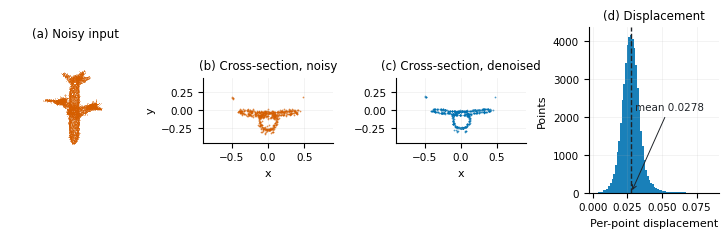

# 计图挑战赛赛道二 — 点云去噪与点云分类

第六届计图人工智能挑战赛赛道二的个人参赛作品，基于 [Jittor（计图）](https://github.com/Jittor/jittor) 实现：复现 **StraightPCF**（CVPR 2024）做点云去噪，热身赛用 **PCT** 做三维形状分类。

**技术报告：[`report/tech_report.pdf`](report/tech_report.pdf)** —— 方法、结果，以及哪些没做成。([LaTeX 源码](report/tech_report.tex) · [English README](README.md))

## 结果

| 赛题 | 模型 | 结果 |
|---|---|---|
| 点云去噪 | StraightPCF 复现：两个速度模块，约 0.47M 参数 | 9 个网格留出集上自评 **67.44/100**（竞赛口径，CD 子分 51.9，P2S 子分 82.9）；全国前 100 |
| 三维形状分类 | PCT：2 个采样分组模块 + 4 层 Offset-Attention，约 2.9M 参数 | 热身赛第 12 名，该轮通过线为测试集准确率 ≥ 80% |

留出集整体统计：去噪后相对含噪输入的 Chamfer 距离下降 51%、点到面误差下降 67%。论文报告的精度来自它自己的高斯噪声数据集，与本次比赛使用的 Laplace 噪声不可直接比较；报告认为七月重构中掉的分主要来自噪声模型的改变。

**提交版本与仓库里的代码不是同一套管线**：提交版直接在真实含噪点云上训练，没有 coupling 项也没有 DistanceModule；七月改成论文式的合成高斯噪声后掉了 2.65 分。详见报告第 3 节与第 6 节。



## 仓库结构

```
├── denoise/                 # 点云去噪
│   ├── run.py               #   训练 / 推理 / 调试入口
│   ├── self_eval.py         #   留出集自评测，CD + P2S
│   ├── evaluate.py          #   官方风格评测脚本
│   ├── profile.py           #   数据与计算耗时分析、batch size 探测
│   ├── vis_denoising.py     #   逐样本去噪诊断
│   ├── configs/             #   YAML 配置：task / data / model / system / transform
│   └── src/
│       ├── data/            #   网格采样、归一化、噪声、patch 构造
│       ├── model/           #   EdgeConv 编码器、速度模块、距离模块
│       └── system/          #   训练器与结果保存
├── warmup/                  # ModelNet40 分类（PCT）
│   ├── train.py             #   训练与推理
│   ├── rf_pct.py            #   PCT 基础模块：Offset-Attention、采样分组
│   └── rf_ops.py            #   底层算子：FPS、KNN、Ball Query
├── report/                  # 技术报告
│   ├── tech_report.pdf
│   ├── tech_report.tex
│   └── make_figures.py      #   由训练日志重绘报告插图
└── README.zh-CN.md          # 中文版 README
```

## 快速开始

环境：

```bash
conda create -n jittor python=3.9 -y
conda activate jittor
conda install -c conda-forge gcc=10 gxx=10 libgomp -y
pip install jittor numpy trimesh scipy omegaconf matplotlib
pip install point-cloud-utils   # 可选，用于精确 P2S 评测
```

去噪，在 `denoise/` 下执行：

```bash
cd denoise

# 单卡训练
python run.py --task configs/task/train_vm.yaml

# MPI 多卡分布式训练
CUDA_VISIBLE_DEVICES="0,1,2,3,4,5" mpirun -np 6 python run.py --task configs/task/train_vm.yaml

# 推理，先在配置中指定 load_ckpt
python run.py --task configs/task/predict_vm.yaml

# 留出集自评测
python self_eval.py --task configs/task/train_vm.yaml --split_ratio 0.1 --num_samples 10000
```

论文的分阶段训练有独立配置：`configs/task/train_vm_stage{1..4}.yaml`。ScoreDenoise 风格的变体在 `src/model/score_vm.py`，配置为 `train_score.yaml` 和 `predict_score.yaml`，未训练到可比状态。

分类，在 `warmup/` 下执行：

```bash
cd warmup
python train.py --data_dir ./data --epochs 300 --batch_size 32
```

## 数据

训练用 ShapeNet 网格与测试用含噪点云由赛事主办方提供，本仓库不包含。代码默认数据放在 `denoise/dataset_train/` 和 `denoise/dataset_test_noisy/`，划分列表在 `denoise/datalist/`，目录格式见 `denoise/README.md`。

## 文档

| 文档 | 语言 | 内容 |
|---|---|---|
| [`report/tech_report.pdf`](report/tech_report.pdf) | 英文 | 方法、Jittor 工程实现、结果、失败复盘 |
| [`denoise/README.md`](denoise/README.md) | 中文 | 去噪：用法、配置、打包提交、常见问题 |
| [`warmup/README.md`](warmup/README.md) | 中文 | 分类：模型架构、训练策略、改进历程 |

## 状态

比赛已于 2026 年结束，代码保持原样归档；结果与失败原因见 `report/tech_report.pdf`。

## 许可

采用 MIT 许可证，见 [LICENSE](LICENSE)。

## 参考文献

- StraightPCF: *Straight Point Cloud Filtering*, CVPR 2024 —— 复现的方法，编码器/解码器结构参照其官方实现。
- ScoreDenoise: *Score-Based Point Cloud Denoising*, ICCV 2021 —— `src/model/score_vm.py` 中的 score 变体。
- PCT: *Point Cloud Transformer*, Computational Visual Media 2021 —— 热身赛分类器。
- PointNet++（Qi 等，NeurIPS 2017）—— `warmup/rf_ops.py` 中的 `index_points`、`square_distance`、ball query 与 KNN 内核移植并改编自它，原实现为 MIT 许可。
